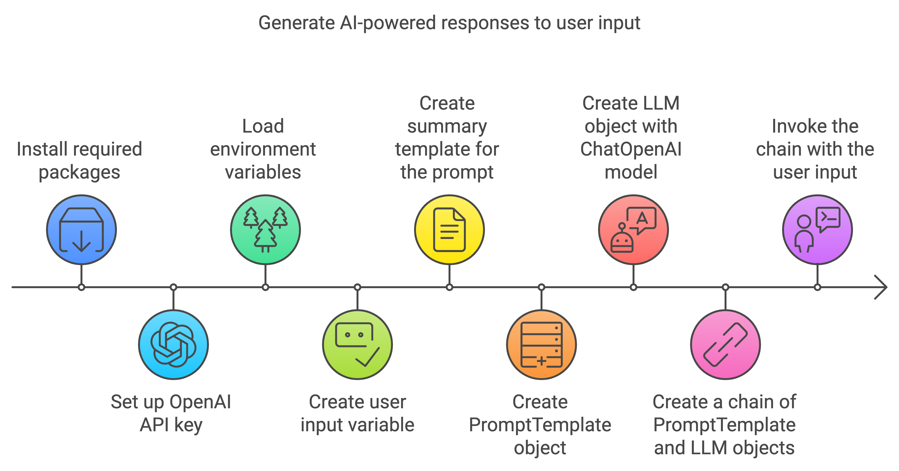

## 1. Project Setup

### Package installtion
pipenv install langchain
pipenv install langchain-community
pipenv install langchain-openai
pipenv install langchainhub
pipenv install black 

### Create a new file IceBreaker.py
   * Add main function with hello world
   * Run the file and check if this is working.
   * create a script runner as interpreter and run the file.
   * Add new package for formatting the code. name as black.
   * Run command "black ."

### ** How to fix issue - Pipenv issue ["  import _osx_support, distutils.sysconfig
    ModuleNotFoundError: No module named 'distutils'"]
    brew install python-tk
    pip install --upgrade setuptools

## 2 Environment Variables and .env File
    * Create a new file .env
    * Add a new variable "COOL_API_KEY=1234567890"
    * Add new package - pipenv install python-dotenv
    * Add the code - 
        from dotenv import load_dotenv
        load_dotenv()
        print(os.environ["COOL_API_KEY"])

## 3. Your First LangChain application - Chaining a simple prompt
    * Create a new file - "prompt.py"
    * Sudo logic will like this -  
        * Pre-requisite: Install langchain-core and langchain-openai packages
        * Pre-requisite: Create OpenAI API key and set it in the environment variable OPENAI_API_KEY
        * load the package langchain core for PromptTemplate & ChatOpenAI
        * Create user input variable for the prompt
        * Create the main function
        * Create summary template for the prompt
        * Create PromptTemplate object with the summary template
        * Create LLM object with ChatOpenAI model like GPT-3-turbo or GPT-4
        * Create a chain of PromptTemplate and LLM objects with the user input
        * Invoke the chain with the user input

    